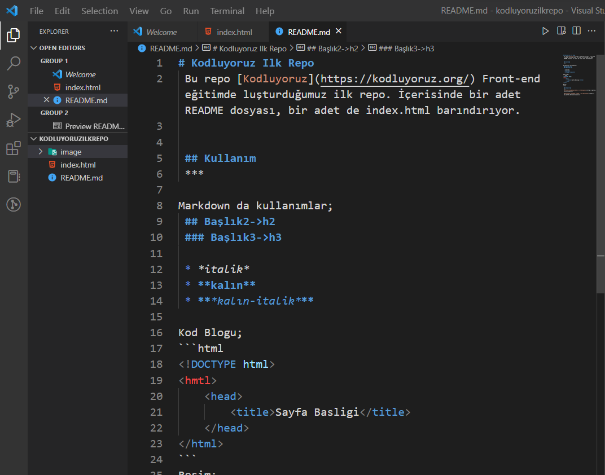
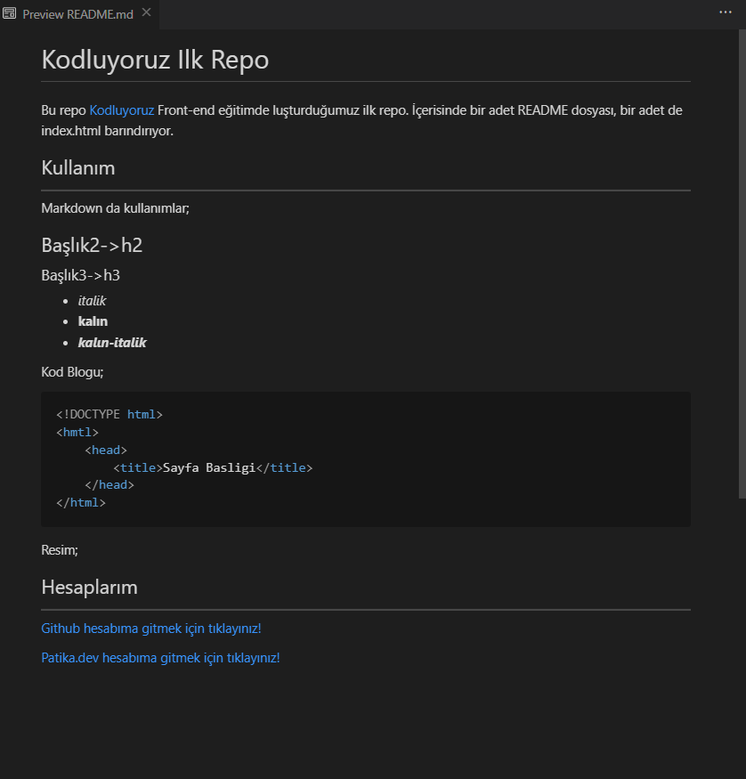

# Kodluyoruz Ilk Repo

Bu repo [Kodluyoruz](https://kodluyoruz.org/) Front-end eğitimde luşturduğumuz ilk repo. İçerisinde bir adet README dosyası, bir adet de index.html barındırıyor.

## Kullanım

---

Markdown da kullanımlar;

## Başlık2->h2

### Başlık3->h3

- _italik_
- **kalın**
- **_kalın-italik_**

Kod Blogu;

```html
<!DOCTYPE html>
<html lang="tr">
  <head>
    <title>Sayfa Basligi</title>
  </head>
</html>
```

Resim;



## Hesaplarım

---

[Github hesabıma gitmek için tıklayınız!](https://github.com/cetinyazici)

[Patika.dev hesabıma gitmek için tıklayınız!](https://app.patika.dev/yazilimyazici)

---
